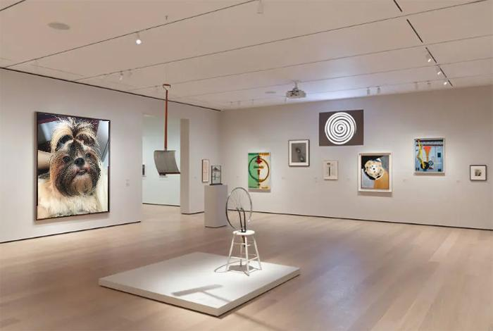

# Computer Graphics

## Projection

This script takes two pictures: the texture and the scene.
- The texture is an image which one wishes to project.
- The scene is a 3D image in which one wishes to project the texture.

Here's an example:

